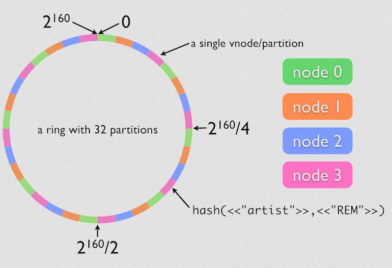

Riak Core in Small Bytes
------------------------

.. image:: flavio.jpg
   :align: center
   :width: 50%

Lessons learned while developing `IorioDB <https://github.com/marianoguerra/ioriodb>`_

Mariano Guerra, EFL Berlin 2014

Warning
-------

* Lots of code and console output ahead
* No need to read it or understand it all
* I will point the interesting parts
* Each step of this talk is a commit on a git repo
* That repo has the longest readme ever
* With all the details of this talk and more
* This slides will be available there as well

Things that I won't cover
-------------------------

but you should check

CAP
---

.. image:: cap.png
   :align: center

"The Ring"
----------

CRDTs
-----

Leslie Lamport
--------------

Jepsen
------

Kyle Kingsbury aka @aphyr

Also...
-------

Don't tell Kyle Kingsbury I'm developing a data store :P

Let's Start
-----------

But before some questions

* Do you know riak?
* Do you know riak_core? at least from name?

Setup rebar riak_core template
------------------------------

.. code:: shell-session

    git clone https://github.com/basho/rebar_riak_core.git
    cd rebar_riak_core
    make install

Create project template
-----------------------

.. code:: shell-session

    mkdir flaviodb
    cd flaviodb

    # download rebar and set executable permissions
    wget http://cloud.github.com/downloads/basho/rebar/rebar
    chmod u+x rebar

    # create project from riak_core template with app id set to flavio
    ./rebar create template=riak_core appid=flavio

Update riak core version to 2.0.0
---------------------------------

edit rebar.config

* riak_core 2.0.0
* lager 2.0.3

Trying to build it
------------------

.. code:: shell-session

    make rel

if you use Erlang >= 17

.. code:: shell-session

    ./util/fix_deps_warnings_as_errors.sh

Running a node
--------------

Start console

.. code:: shell-session

    ./rel/flavio/bin/flavio console

Play with it

.. class:: prettyprint lang-erlang

.. code:: erlang

    (flavio@127.0.0.1)1> flavio:ping().
    {pong,1210306043414653979137426502093171875652569137152}

The road of the ping
--------------------

flavio.erl

.. class:: prettyprint lang-erlang

.. code:: erlang

    -module(flavio).
    -export([ping/0]).

    ping() ->
        DocIdx = riak_core_util:chash_key({<<"ping">>,
                                            term_to_binary(now())}),

        PrefList = riak_core_apl:get_primary_apl(DocIdx, 1, flavio),

        [{IndexNode, _Type}] = PrefList,

        riak_core_vnode_master:sync_spawn_command(IndexNode, ping,
                                                    flavio_vnode_master).

The road of the ping 1
----------------------

flavio_vnode.erl

.. class:: prettyprint lang-erlang

.. code:: erlang

    -module(flavio_vnode).
    -behaviour(riak_core_vnode).
    -export([start_vnode/1, init/1, terminate/2,
             handle_command/3, is_empty/1, delete/1,
             handle_handoff_command/3, handoff_starting/2,
             handoff_cancelled/1, handoff_finished/2,
             handle_handoff_data/2, encode_handoff_item/2,
             handle_coverage/4, handle_exit/3]).

    -record(state, {partition}).

The road of the ping 2
----------------------

flavio_vnode.erl

.. class:: prettyprint lang-erlang

.. code:: erlang

    start_vnode(I) ->
        riak_core_vnode_master:get_vnode_pid(I, ?MODULE).

    init([Partition]) ->
        {ok, #state { partition=Partition }}.

    handle_command(ping, _Sender, State) ->
        {reply, {pong, State#state.partition}, State};

    handle_command(Message, _Sender, State) ->
        ?PRINT({unhandled_command, Message}),
        {noreply, State}.

Creating a local cluster
------------------------

.. code:: shell-session

    make devrel

Output

.. code:: shell-session

    mkdir -p dev
    rel/gen_dev dev1 rel/vars/dev_vars.config.src rel/vars/dev1_vars.config
    Generating dev1 - node='flavio1@127.0.0.1' http=10018 handoff=10019
    (cd rel && /home/mariano/src/rct/flaviodb/rebar generate
        target_dir=../dev/dev1 overlay_vars=vars/dev1_vars.config)

    ...

    mkdir -p dev
    rel/gen_dev dev4 rel/vars/dev_vars.config.src rel/vars/dev4_vars.config
    Generating dev4 - node='flavio4@127.0.0.1' http=10048 handoff=10049
    (cd rel && /home/mariano/src/rct/flaviodb/rebar generate
        target_dir=../dev/dev4 overlay_vars=vars/dev4_vars.config)

Starting a local cluster
------------------------

.. code:: shell-session

    for d in dev/dev*; do $d/bin/flavio start; done

.. code:: shell-session

    for d in dev/dev*; do $d/bin/flavio ping; done

    pong
    pong
    pong
    pong

Checking cluster status
-----------------------

.. code:: shell-session

    $ dev/dev1/bin/flavio-admin member-status

    ================================= Membership ==================================
    Status     Ring    Pending    Node
    -------------------------------------------------------------------------------
    valid     100.0%      --      'flavio1@127.0.0.1'
    -------------------------------------------------------------------------------
    Valid:1 / Leaving:0 / Exiting:0 / Joining:0 / Down:0

Checking cluster status 1
-------------------------

.. code:: shell-session

    $ dev/dev4/bin/flavio-admin member-status

    ================================= Membership ==================================
    Status     Ring    Pending    Node
    -------------------------------------------------------------------------------
    valid     100.0%      --      'flavio4@127.0.0.1'
    -------------------------------------------------------------------------------
    Valid:1 / Leaving:0 / Exiting:0 / Joining:0 / Down:0

Actually clustering the nodes
-----------------------------

.. code:: shell-session

    $ for d in dev/dev{2,3,4}; do
        $d/bin/flavio-admin cluster join flavio1@127.0.0.1;
      done

    Success: staged join request for 'flavio2@127.0.0.1' to 'flavio1@127.0.0.1'
    Success: staged join request for 'flavio3@127.0.0.1' to 'flavio1@127.0.0.1'
    Success: staged join request for 'flavio4@127.0.0.1' to 'flavio1@127.0.0.1'

Actually clustering the nodes 1
-------------------------------

.. code:: shell-session

    $ dev/dev1/bin/flavio-admin member-status

    ================================= Membership ==================================
    Status     Ring    Pending    Node
    -------------------------------------------------------------------------------
    joining     0.0%      --      'flavio2@127.0.0.1'
    joining     0.0%      --      'flavio3@127.0.0.1'
    joining     0.0%      --      'flavio4@127.0.0.1'
    valid     100.0%      --      'flavio1@127.0.0.1'
    -------------------------------------------------------------------------------
    Valid:1 / Leaving:0 / Exiting:0 / Joining:3 / Down:0

Actually clustering the nodes 2
-------------------------------

.. code:: shell-session

    $ dev/dev1/bin/flavio-admin cluster plan

    =============================== Staged Changes ================================
    Action         Details(s)
    -------------------------------------------------------------------------------
    join           'flavio2@127.0.0.1'
    join           'flavio3@127.0.0.1'
    join           'flavio4@127.0.0.1'
    -------------------------------------------------------------------------------

    NOTE: Applying these changes will result in 1 cluster transition

Actually clustering the nodes 2 (cont.)
---------------------------------------

.. code:: shell-session

                             After cluster transition 1/1
    ================================= Membership ==================================
    Status     Ring    Pending    Node
    -------------------------------------------------------------------------------
    valid     100.0%     25.0%    'flavio1@127.0.0.1'
    valid       0.0%     25.0%    'flavio2@127.0.0.1'
    valid       0.0%     25.0%    'flavio3@127.0.0.1'
    valid       0.0%     25.0%    'flavio4@127.0.0.1'
    -------------------------------------------------------------------------------
    Valid:4 / Leaving:0 / Exiting:0 / Joining:0 / Down:0

    Transfers resulting from cluster changes: 48
      16 transfers from 'flavio1@127.0.0.1' to 'flavio4@127.0.0.1'
      16 transfers from 'flavio1@127.0.0.1' to 'flavio3@127.0.0.1'
      16 transfers from 'flavio1@127.0.0.1' to 'flavio2@127.0.0.1'

Actually clustering the nodes 3
-------------------------------

.. code:: shell-session

    $ dev/dev1/bin/flavio-admin cluster commit

    Cluster changes committed

.. code:: shell-session

    $ dev/dev1/bin/flavio-admin member-status

    ================================= Membership ==================================
    Status     Ring    Pending    Node
    -------------------------------------------------------------------------------
    valid      25.0%      --      'flavio1@127.0.0.1'
    valid      25.0%      --      'flavio2@127.0.0.1'
    valid      25.0%      --      'flavio3@127.0.0.1'
    valid      25.0%      --      'flavio4@127.0.0.1'
    -------------------------------------------------------------------------------
    Valid:4 / Leaving:0 / Exiting:0 / Joining:0 / Down:0

Trying our cluster
------------------

From node 1:

.. code:: shell-session

    $ dev/dev1/bin/flavio attach
    Attaching to /tmp/.../flaviodb/dev/dev1/erlang.pipe.1 (^D to exit)

.. class:: prettyprint lang-erlang
.. code:: erlang

    (flavio1@127.0.0.1)1> flavio:ping().
    {pong,822094670998632891489572718402909198556462055424}
    (flavio1@127.0.0.1)2> [Quit]

Trying our cluster
------------------

From node 3:

.. code:: shell-session

    $ dev/dev3/bin/flavio attach
    Attaching to /tmp/.../flaviodb/dev/dev3/erlang.pipe.1 (^D to exit)

.. class:: prettyprint lang-erlang
.. code:: erlang

    (flavio3@127.0.0.1)1> flavio:ping().
    {pong,1438665674247607560106752257205091097473808596992}
    (flavio3@127.0.0.1)2> [Quit]

Adding a command
----------------

flavio.erl

.. class:: prettyprint lang-erlang

.. code:: erlang

    -export([ping/0, add/2]).

    add(A, B) ->
        DocIdx = riak_core_util:chash_key({<<"add">>,
                                            term_to_binary({A, B})}),

        PrefList = riak_core_apl:get_primary_apl(DocIdx, 1, flavio),
        [{IndexNode, _Type}] = PrefList,

        riak_core_vnode_master:sync_spawn_command(IndexNode, {add, A, B},
                                                    flavio_vnode_master).

Adding a command
----------------

flavio_vnode.erl

.. class:: prettyprint lang-erlang

.. code:: erlang

    handle_command({add, A, B}, _Sender, State) ->
        {reply, {A + B, State#state.partition}, State};

Playing with our command
------------------------

.. code:: shell-session

    rm -rf rel/flavio
    make rel
    ./rel/flavio/bin/flavio console

Playing with our command
------------------------

.. class:: prettyprint lang-erlang

.. code:: erlang

    (flavio@127.0.0.1)1> flavio:add(2, 5).
    {7,959110449498405040071168171470060731649205731328}

    (flavio@127.0.0.1)2> flavio:add(2, 5).
    {7,959110449498405040071168171470060731649205731328}

    (flavio@127.0.0.1)4> flavio:add(3, 5).
    {8,91343852333181432387730302044767688728495783936}

    (flavio@127.0.0.1)5> flavio:add(3, 5).
    {8,91343852333181432387730302044767688728495783936}

    (flavio@127.0.0.1)7> flavio:add(2, 9).
    {11,1255977969581244695331291653115555720016817029120}

    (flavio@127.0.0.1)8> flavio:add(2, 9).
    {11,1255977969581244695331291653115555720016817029120}

Keeping state
-------------

.. class:: prettyprint lang-erlang

.. code:: erlang

    -record(state, {partition, ops_count=0}).

    handle_command({add, A, B}, _Sender,
                    State=#state{ops_count=CurrentCount}) ->

        NewCount = CurrentCount + 1,
        NewState = State#state{ops_count=NewCount},

        {reply, {A + B, State#state.partition}, NewState};

Querying all vnodes' state
--------------------------

flavio.erl

.. class:: prettyprint lang-erlang

.. code:: erlang

    stats() ->
        Timeout = 5000,
        flavio_coverage_fsm:start(stats, Timeout).

Querying all vnodes' state
--------------------------

flavio_sup.erl

.. class:: prettyprint lang-erlang

.. code:: erlang

    init(_Args) ->
        VMaster = { flavio_vnode_master,
                      {riak_core_vnode_master, start_link, [flavio_vnode]},
                      permanent, 5000, worker, [riak_core_vnode_master]},

        CoverageFSMs = {flavio_coverage_fsm_sup,
                        {flavio_coverage_fsm_sup, start_link, []},
                        permanent, infinity, supervisor,
                        [flavio_coverage_fsm_sup]},

        {ok, { {one_for_one, 5, 10}, [VMaster, CoverageFSMs]}}.

Querying all vnodes' state
--------------------------

flavio_vnode.erl

.. class:: prettyprint lang-erlang

.. code:: erlang

    handle_coverage(stats, _KeySpaces, {_, RefId, _},
                    State=#state{ops_count=OpsCount}) ->

        {reply, {RefId, [{ops_count, OpsCount}]}, State};

    handle_coverage(Req, _KeySpaces, _Sender, State) ->
        lager:warning("unknown coverage received ~p", [Req]),
        {norepl, State}.

Actually querying vnodes's state
--------------------------------

.. class:: prettyprint lang-erlang

.. code:: erlang

    (flavio@127.0.0.1)1> flavio:stats().
    {ok,[ lot of output here]}

    % use the api a little
    (flavio@127.0.0.1)2> flavio:add(2, 5).
    {7,959110449498405040071168171470060731649205731328}

    ...

    (flavio@127.0.0.1)8> flavio:stats().
    {ok,[ lot of output here, maybe you can see some with ops_count > 0]}

Actually querying vnodes's state
--------------------------------

.. class:: prettyprint lang-erlang

.. code:: erlang

    % filter the output to see interesting info
    10> lists:filter(fun ({_, _, [{ops_count, OpsCount}]}) ->
                          OpsCount > 0
                     end, Stats).

    [{1278813932664540053428224228626747642198940975104,
        'flavio@127.0.0.1', [{ops_count,3}]},
     {959110449498405040071168171470060731649205731328,
        'flavio@127.0.0.1', [{ops_count,1}]},
     {182687704666362864775460604089535377456991567872,
        'flavio@127.0.0.1', [{ops_count,2}]}]

Tolerating faults in our additions (?)
--------------------------------------

.. code:: shell-session

   +------+    +---------+    +---------+    +---------+              +------+
   |      |    |         |    |         |    |         |remaining = 0 |      |
   | Init +--->| Prepare +--->| Execute +--->| Waiting +------------->| Stop |
   |      |    |         |    |         |    |         |              |      |
   +------+    +---------+    +---------+    +-------+-+              +------+
                                                 ^   | |                    
                                                 |   | |        +---------+ 
                                                 +---+ +------->|         | 
                                                                | Timeout | 
                                         remaining > 0  timeout |         | 
                                                                +---------+ 

Tolerating faults in our additions (?)
--------------------------------------

flavio_vnode.erl

.. class:: prettyprint lang-erlang

.. code:: erlang

    handle_command({RefId, {add, {A, B}}}, _Sender,
                   State=#state{ops_count=CurrentCount}) ->

        NewCount = CurrentCount + 1,
        NewState = State#state{ops_count=NewCount},

        {reply, {RefId, {A + B, State#state.partition}}, NewState};

Tolerating faults in our additions (?)
--------------------------------------

flavio.erl

.. class:: prettyprint lang-erlang

.. code:: erlang

    add(A, B) ->
        N = 3,
        W = 3,
        Timeout = 5000,

        {ok, ReqID} = flavio_op_fsm:op(N, W, {add, {A, B}}),
        wait_for_reqid(ReqID, Timeout).

Tolerating faults in our additions (?)
--------------------------------------

.. class:: prettyprint lang-erlang

.. code:: erlang

    (flavio@127.0.0.1)1> flavio:add(2, 4).
    {ok,[{6,433...},
         {6,388...},
         {6,411...}]}

    (flavio@127.0.0.1)2> flavio:add(12, 4).
    {ok,[{16,685...},
         {16,456...},
         {16,228...}]}

Writing something
-----------------

.. class:: prettyprint lang-erlang

.. code:: erlang

    flavio:post_msg(Username, Stream, Msg)

rebar.config

.. class:: prettyprint lang-erlang

.. code:: erlang

    {fixstt, ".*", {git, "git://github.com/marianoguerra/fixstt",
                         {branch, "master"}}}

Writing something
-----------------

flavio.erl

.. class:: prettyprint lang-erlang

.. code:: erlang

    post_msg(Username, Stream, Msg) ->
        N = 3,
        W = 3,
        Timeout = 5000,

        {ok, ReqID} = flavio_op_fsm:op(N, W, {post_msg, {Username, Stream, Msg}},
                                       {Username, Stream}),
        wait_for_reqid(ReqID, Timeout).

Writing something
-----------------

flavio_vnode.erl

.. class:: prettyprint lang-erlang

.. code:: erlang

    handle_command({RefId, {post_msg, {Username, Stream, Msg}}}, _Sender,
                   State=#state{partition=Partition}) ->

        PartitionStr = integer_to_list(Partition),
        StreamPath = filename:join([PartitionStr, Username, Stream, "msgs"]),

        ok = filelib:ensure_dir(StreamPath),
        {ok, StreamIo} = fixsttio:open(StreamPath),

        Entry = fixstt:new(Msg),
        {ok, _NewStream, EntryId} = fixsttio:append(StreamIo, Entry),

        EntryWithId = fixstt:set(Entry, id, EntryId),
        {reply, {RefId, {EntryWithId, State#state.partition}}, State};

Playing with it
----------------

.. class:: prettyprint lang-erlang

.. code:: erlang

    (flavio@127.0.0.1)1> flavio:post_msg(<<"mariano">>, <<"english">>,
                                                        <<"hello world!">>).

    {ok,[{{fixstt,1,9001,9001,12,1416928004032,0,0, <<"hello world!">>},
          981...},
         {{fixstt,1,9001,9001,12,1416928004032,0,0, <<"hello world!">>},
          959...},
         {{fixstt,1,9001,9001,12,1416928004032,0,0, <<"hello world!">>},
          100...}]}

    (flavio@127.0.0.1)2> flavio:post_msg(<<"mariano">>, <<"spanish">>,
                                                        <<"hola mundo!">>).
    {ok,[{{fixstt,1,9001,9001,11,1416928004035,0,0, <<"hola mundo!">>},
          890...},
         {{fixstt,1,9001,9001,11,1416928004035,0,0,<<"hola mundo!">>},
          867...},
         {{fixstt,1,9001,9001,11,1416928004035,0,0,<<"hola mundo!">>},
          844...}]}

Confirming it's written
-----------------------

.. code:: shell-session

    $ cd rel/flavio
    $ find -name msgs

    ./890.../mariano/spanish/msgs
    ./844.../mariano/spanish/msgs
    ./100.../mariano/english/msgs
    ./959.../mariano/english/msgs
    ./867.../mariano/spanish/msgs
    ./981.../mariano/english/msgs

Reading what we wrote
---------------------

.. class:: prettyprint lang-erlang

.. code:: erlang

    handle_command({RefId, {get_msgs, {Username, Stream, Id, Count}}}, _Sender,
                        State) ->

        {ok, StreamIo} = get_stream(State, Username, Stream),
        Result = case fixsttio:read(StreamIo, Id, Count) of
                     {ok, StreamIo1, Entries} ->
                         {ok, _StreamIo2} = fixstt:close(StreamIo1),
                         {ok, Entries};
                     Other -> Other
                 end,

        {reply, {RefId, {Result, State#state.partition}}, State};

Trying it
---------

.. class:: prettyprint lang-erlang

.. code:: erlang

    (flavio@127.0.0.1)8> % query from mariano/spanish from id 1, get 1 post
    (flavio@127.0.0.1)8> flavio:get_msgs(<<"mariano">>, <<"spanish">>, 1, 1).
    {ok,[{{ok,[{fixstt,1,9001.0,9001.0,11,1416930275765,0,0, <<"hola mundo!">>}]},
          867...},
         {{ok,[{fixstt,1,9001.0,9001.0,11,1416930275765,0,0, <<"hola mundo!">>}]},
          890...},
         {{ok,[{fixstt,1,9001.0,9001.0,11,1416930275765,0,0, <<"hola mundo!">>}]},
          844...}]}

Using coverage calls for something useful
-----------------------------------------

.. class:: prettyprint lang-erlang

.. code:: erlang

    list_streams(Username) ->
        Timeout = 5000,
        flavio_coverage_fsm:start({list_streams, Username}, Timeout).

and the implementation:

.. class:: prettyprint lang-erlang

.. code:: erlang

    handle_coverage({list_streams, Username}, _KeySpaces, {_, RefId, _}, State) ->
        Streams = lists:sort(list_streams(State, Username)),
        {reply, {RefId, {ok, Streams}}, State};

list users is implemented similarly

Handoff
-------

.. code:: shell-session

     +-----------+      +----------+        +----------+                
     |           | true |          | false  |          |                
     | Starting  +------> is_empty +--------> fold_req |                
     |           |      |          |        |          |                
     +-----+-----+      +----+-----+        +----+-----+                
           |                 |                   |                      
           | false           | true              | ok                   
           |                 |                   |                      
     +-----v-----+           |              +----v-----+     +--------+ 
     |           |           |              |          |     |        | 
     | Cancelled |           +--------------> finished +-----> delete | 
     |           |                          |          |     |        | 
     +-----------+                          +----------+     +--------+ 

Handoff
-------

.. class:: prettyprint lang-erlang

.. code:: erlang

    handle_handoff_command(?FOLD_REQ{foldfun=Fun, acc0=Acc0}, _Sender, State) ->
        % pseudocode
        for Stream in AllUserStreams:
            for Key, Entry in get_entries(Stream):
                % pardon the mutability, it is just to make the code smaller
                Acc = Fun(Key, Entry, Acc)

        return reply, Acc, State

    encode_handoff_item(Key, Value) ->
        term_to_binary({Key, Value}).

    handle_handoff_data(BinData, State) ->
        TermData = binary_to_term(BinData),
        {Key, Value} = TermData,
        % do something with it here

Real Handoff
------------

.. class:: prettyprint lang-erlang

.. code:: erlang

    handle_handoff_command(?FOLD_REQ{foldfun=Fun, acc0=Acc0}, _Sender,
                            State=#state{partition=Partition}) ->
        AllPairs = list_all(State),
        HandlePair = fun (Key={Username, StreamName}, AccIn) ->
                 HandleEntry = fun (Entry, AccIn0) ->
                                       AccIn1 = Fun(Key, Entry, AccIn0),
                                       {continue, AccIn1}
                               end,

                 StreamPath = stream_path(State, Username, StreamName),
                 {ok, FixSttIo} = fixsttio:open(StreamPath),
                 {ok, AccIn1} = fixsttio:iterate(FixSttIo, HandleEntry, AccIn),
                 {ok, _ClosedFixSttIo} = fixsttio:close(FixSttIo),

                 AccIn1
         end,

        AccFinal = lists:foldl(HandlePair, Acc0, AllPairs),
        {reply, AccFinal, State};

Trying Handoff
--------------

* build devrel
* start 1 node
* write to it
* start another node
* join the first node
* watch handoff
* confirm data moved

Handoff Output Node 1
---------------------

multiply it by 32

.. code:: shell-session

    (flavio1@127.0.0.1)12>
    10:53:57.316 [info] 'flavio2@127.0.0.1' joined cluster with status 'joining'

    10:54:26.600 [info] handoff starting 456...
    10:54:26.602 [info] handoff is empty? false 228...
    10:54:26.603 [info] handoff cancelled 114...
    10:54:26.619 [info] Starting ownership_transfer transfer of flavio_vnode
        from 'flavio1@127.0.0.1' 228... to 'flavio2@127.0.0.1' 228...
    10:54:26.620 [info] fold req 456...
    10:54:26.620 [info] handling handoff for patrick/spanish
    10:54:26.667 [info] ownership_transfer transfer of flavio_vnode
        from 'flavio1@127.0.0.1' 456...
        to 'flavio2@127.0.0.1' 456...
        completed: sent 1.08 KB bytes in 10 of 10 objects in 0.05 seconds 
        (23.45 KB/second)
    10:54:26.668 [info] handoff finished 228...
    10:54:26.681 [info] handoff delete flavio_data/456...
    10:54:26.683 [info] terminate 456...: normal

Handoff Output Node 2
---------------------

multiply it by 32

.. code:: shell-session

    (flavio2@127.0.0.1)1>
    10:54:21.864 [info] 'flavio2@127.0.0.1' changed from 'joining' to 'valid'
    10:54:26.620 [info] Receiving handoff data for partition flavio_vnode:456...
        from {"127.0.0.1",34478}
    10:54:26.669 [info] Handoff receiver for partition 228... exited after
        processing 10 objects from {"127.0.0.1",32835}
    10:54:36.614 [info] Receiving handoff data for partition flavio_vnode:137...
        from {"127.0.0.1",53206}
    10:55:23.619 [info] handoff starting 685...
    10:55:23.639 [info] handoff is empty? true 137...
    10:55:23.639 [info] handoff delete flavio_data/137...
    10:55:23.640 [info] terminate 890...: normal

Directories in Node 1
---------------------

.. code:: shell-session

    $ tree dev/dev1/flavio_data
    dev/dev1/flavio_data
    ├── 0
    │   └── patrick
    │       └── spanish
    │           └── msgs
    ├── 1073290264914881830555831049026020342559825461248
    │   └── gary
    │       └── english
    │           └── msgs
    ├── 1164634117248063262943561351070788031288321245184
    │   ├── bob
    │   │   └── riak_core
    │   │       └── msgs
    │   └── gary
    │       └── spanish
    │           └── msgs

    ...

    ├── 707914855582156101004909840846949587645842325504
    │   └── sandy
    │       └── erlang
    │           └── msgs
    └── 91343852333181432387730302044767688728495783936
        └── sandy
            └── english
                └── msgs

    63 directories, 22 files

Directories in Node 2
---------------------

.. code:: shell-session

    $ tree dev/dev2/flavio_data
    dev/dev2/flavio_data
    ├── 1118962191081472546749696200048404186924073353216
    │   ├── bob
    │   │   └── riak_core
    │   │       └── msgs
    │   └── gary
    │       └── english
    │           └── msgs

    ...

    ├── 662242929415565384811044689824565743281594433536
    │   ├── patrick
    │   │   └── english
    │   │       └── msgs
    │   └── sandy
    │       └── erlang
    │           └── msgs
    └── 685078892498860742907977265335757665463718379520
        ├── patrick
        │   └── english
        │       └── msgs
        └── sandy
            └── erlang
                └── msgs

    67 directories, 26 files

Providing an API
----------------

.. class:: prettyprint lang-erlang
.. code:: erlang

    {cowboy, "1.0.0", {git, "https://github.com/ninenines/cowboy", {tag, "1.0.0"}}},
    {jsxn, ".*", {git, "https://github.com/talentdeficit/jsxn", {tag, "v2.1.1"}}}

Start cowboy on server startup
------------------------------

flavio_app.erl

.. class:: prettyprint lang-erlang
.. code:: erlang

    start(_StartType, _StartArgs) ->
        Dispatch = cowboy_router:compile([
            {'_', [{"/msgs/:user/:topic", handler_flavio_msgs, []}]}
        ]),
        ApiPort = 8080,
        ApiAcceptors = 100,
        {ok, _} = cowboy:start_http(http, ApiAcceptors, [{port, ApiPort}], [
            {env, [{dispatch, Dispatch}]}
        ]),
    ....

Implement the request handler
-----------------------------

handler_flavio_msgs.erl

.. class:: prettyprint lang-erlang
.. code:: erlang

    -record(state, {username, topic}).

    init({tcp, http}, _Req, _Opts) -> {upgrade, protocol, cowboy_rest}.

    rest_init(Req, []) ->
        {Username, Req1} = cowboy_req:binding(username, Req),
        {Topic, Req2} = cowboy_req:binding(topic, Req1),

        {ok, Req2, #state{username=Username, topic=Topic}}.

    allowed_methods(Req, State) -> {[<<"POST">>], Req, State}.

    content_types_accepted(Req, State) ->
        {[{{<<"application">>, <<"json">>, '*'}, from_json}], Req, State}.

Implement the request handler
-----------------------------

.. class:: prettyprint lang-erlang
.. code:: erlang

    from_json(Req, State=#state{username=Username, topic=Topic}) ->
        {ok, Body, Req1} = cowboy_req:body(Req),
        case jsx:is_json(Body) of
            true ->
                Data = jsx:decode(Body),
                Msg = proplists:get_value(<<"msg">>, Data, nil),

                if is_binary(Msg) ->
                       {ok, [FirstResponse|_]} = flavio:post_msg(Username,
                                                                   Topic, Msg),
                       {{ok, Entity}, _Partition} = FirstResponse,
                       EntityPList = fixstt:to_proplist(Entity),
                       EntityJson = jsx:encode(EntityPList),
                       response(Req, State, EntityJson);
                   true ->
                       bad_request(Req1, State, <<"{\"type\": \"no-msg\"}">>)
                end;
            false ->
                bad_request(Req1, State, <<"{\"type\": \"invalid-body\"}">>)
        end.

Try the API
-----------

.. code:: shell-session

    $ curl -X POST http://localhost:8080/msgs/mariano/english \
        -H "Content-Type: application/json" -d '{"msg": "hello world"}'
    {"id":1,"lat":9001,"lng":9001,"date":1417081176410,"ref":0,"type":0,
     "msg":"hello world"}

    $ curl -X POST http://localhost:8080/msgs/mariano/english \
        -H "Content-Type: application/json" -d '{"msg": "hello world again"}'
    {"id":2,"lat":9001,"lng":9001,"date":1417081185756,"ref":0,"type":0,
     "msg":"hello world again"}

    $ curl -X POST http://localhost:8080/msgs/mariano/spanish \
        -H "Content-Type: application/json" -d '{"msg": "hola mundo"}'
    {"id":1,"lat":9001,"lng":9001,"date":1417081201062,"ref":0,"type":0,
     "msg":"hola mundo"}

    $ curl -X POST http://localhost:8080/msgs/mariano/spanish \
        -H "Content-Type: application/json" -d '{"msg": "hola mundo nuevamente"}'
    {"id":2,"lat":9001,"lng":9001,"date":1417081204533,"ref":0,"type":0,
     "msg":"hola mundo nuevamente"}

Querying through HTTP
---------------------

.. class:: prettyprint lang-erlang
.. code:: erlang

    -record(state, {username, topic, from, limit}).

    rest_init(Req, []) ->
        {Username, Req1} = cowboy_req:binding(username, Req),
        {Topic, Req2} = cowboy_req:binding(topic, Req1),

        {FromStr, Req3} = cowboy_req:qs_val(<<"from">>, Req2, <<"">>),
        {LimitStr, Req4} = cowboy_req:qs_val(<<"limit">>, Req3, <<"1">>),

        From = to_int_or(FromStr, nil),
        Limit = to_int_or(LimitStr, 1),

        {ok, Req4,
            #state{username=Username, topic=Topic, from=From, limit=Limit}}.

    allowed_methods(Req, State) -> {[<<"POST">>, <<"GET">>], Req, State}.

    content_types_provided(Req, State) ->
        {[{{<<"application">>, <<"json">>, '*'}, to_json}], Req, State}.

Querying through HTTP
---------------------

.. class:: prettyprint lang-erlang
.. code:: erlang

    to_json(Req, State=#state{username=Username, topic=Topic, from=From,
            limit=Limit}) ->
        {ok, [FirstResponse|_]} = flavio:get_msgs(Username, Topic, From,
                                                  Limit),
        {{ok, Entities}, _Partition} = FirstResponse,
        EntitiesPList = lists:map(fun fixstt:to_proplist/1, Entities),
        EntitiesJson = jsx:encode(EntitiesPList),

        {EntitiesJson, Req, State}.

Trying the API
--------------

.. code:: shell-session

    $ curl http://localhost:8080/msgs/mariano/spanish\?from\=1\&limit\=1
    [{"id":1,"lat":9001.0,"lng":9001.0,"date":1417084202384,"ref":0,"type":0,
      "msg":"hola mundo"}]

    $ curl http://localhost:8080/msgs/mariano/spanish\?from\=1\&limit\=2
    [{"id":1,"lat":9001.0,"lng":9001.0,"date":1417084202384,"ref":0,"type":0,
      "msg":"hola mundo"},
     {"id":2,"lat":9001.0,"lng":9001.0,"date":1417084204320,"ref":0,"type":0,
       "msg":"hola mundo nuevamente"}]

    $ curl http://localhost:8080/msgs/mariano/spanish\?from\=1\&limit\=20
    [{"id":1,"lat":9001.0,"lng":9001.0,"date":1417084202384,"ref":0,"type":0,
      "msg":"hola mundo"},
     {"id":2,"lat":9001.0,"lng":9001.0,"date":1417084204320,"ref":0,"type":0,
      "msg":"hola mundo nuevamente"}]

    $ curl http://localhost:8080/msgs/mariano/spanish\?limit\=20
    [{"id":1,"lat":9001.0,"lng":9001.0,"date":1417084202384,"ref":0,"type":0,
      "msg":"hola mundo"},
     {"id":2,"lat":9001.0,"lng":9001.0,"date":1417084204320,"ref":0,"type":0,
       "msg":"hola mundo nuevamente"}]

    $ curl http://localhost:8080/msgs/mariano/euskera\?limit\=20
    []

Next Steps
----------

* cache stream handles

  + instead of open/close for each request

* pub/sub for users/topics with bullet
* riak_core_security for auth/permissions
* a web ui

Thanks!
-------

* https://github.com/marianoguerra/flaviodb
* https://github.com/marianoguerra/ioriodb
* `@EventFabricApp <http://twitter.com/EventFabricApp>`_
* `@warianoguerra <http://twitter.com/warianoguerra>`_
